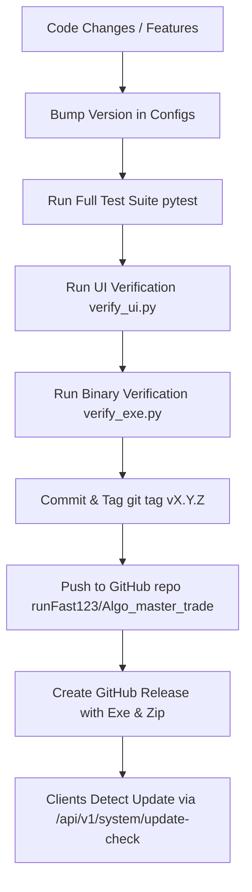

# AGENTS.md — Choice FINX Algo Platform System Knowledge & Rules

This document contains essential context, architectural invariants, safety principles, and operational protocols for any AI agent or developer working on the **Choice FINX Algo Trading Platform**.

---

## 1. System Overview & Architecture

The **Choice FINX Algo Trading Platform** is a local-first desktop algorithmic trading platform for Indian equities and derivatives, integrated with **Choice FINX OpenAPI** via the `choice_api` Python SDK.

```
ChoiceFinxTrader.exe (Desktop Launcher)
  ├── UI Web Server (127.0.0.1:9000) ── Serves static single-page UI & proxies /api/*
  └── Backend Subprocess (127.0.0.1:8080)
        ├── FastAPI (REST routes, auth, tenancy, order book, audit, diagnostics, system)
        ├── Engine Package (in-process: Choice Gateway, DSL, Backtester, Paper Runner, Costs, Risk Manager)
        └── Local Storage (%LOCALAPPDATA%\ChoiceFinxTrader\algo.db & secret.key)
```

### Core Components
1. **`engine/`**: Pure domain logic layer with **zero HTTP surface**. Handles Choice gateway, session registry, DSL parsing, historical backtesting, paper runner, Indian cost model, and risk controls.
2. **`backend/`**: FastAPI REST application handling platform tenancy, authentication, order recording, audit logging, and proxy endpoints. Imports `engine` in-process.
3. **`client-desktop/`**: Launcher, local reverse proxy, license client, and PyInstaller packaging (`build_exe.py`).
4. **`frontend-user/index.html`**: Single-file trading interface with no npm/build step. `client-desktop/static/` is a build artifact and must never be edited directly.
5. **`frontend-admin/index.html`**: Operator console for audit trails, user roles, and platform statistics.
6. **`licence-server/`**: Optional lightweight Vercel/Linux license validation service.

---

## 2. Invariants & Architectural Rules (NEVER Break These)

### Rule 1: The Subprocess Separation
* Both `client-desktop/app/` and `backend/app/` share the top-level Python package name `app`.
* The backend **must run as a separate subprocess** spawned by `client-desktop/app/launcher.py` (using `sys.executable --run-backend <port>`). Never import `backend.app` directly into the launcher process.

### Rule 2: The 4-State SessionMode Matrix
`SessionMode` on `ChoiceSession` is **authoritative**. Never infer trading mode or broker permissions from the mere existence of client objects or credentials.

| Mode | Market Data Source | Order Execution | `uses_broker_data` | `sends_real_orders` |
| :--- | :--- | :--- | :---: | :---: |
| `DISCONNECTED` | None (returns 409) | Rejected | ✗ | ✗ |
| `DEMO` | Local sandbox fixtures | Simulated locally | ✗ | ✗ |
| `PAPER` *(Default)* | **Real live broker data** | Simulated locally at live LTP | **✓** | ✗ |
| `LIVE` | Real live broker data | Submitted to Choice OpenAPI | **✓** | **✓** |

* `sends_real_orders` is **ONLY True for `LIVE`**.
* Changing to `PAPER` is instant; changing to `LIVE` requires explicit user confirmation (`confirm: true`).
* A `DEMO` session can **never** switch to `LIVE`.

### Rule 3: Paper Trading Price Accuracy
* Paper fills for authenticated broker sessions (`PAPER` mode) **must only pull from live touchline quotes or holdings snapshots**.
* Never fall back to demo fixture tables (`_demo_quotes`) for an account with broker credentials. If an instrument is unpriced, refuse execution rather than inventing a price.

### Rule 4: HTTP Retries & Idempotency
* `TimeoutChoiceClient.request` **only retries GET requests** on timeouts or 5xx errors.
* **Never retry non-idempotent HTTP methods (`POST`, `PUT`, `DELETE`)** — Choice endpoints carry no idempotency keys. A timeout on `NewOrder` or `ProcessPayout` could otherwise place a duplicate trade or transfer funds twice.

### Rule 5: Kill Switch Fail-Loud Invariant
* `cancel_all_open` and `orders.halt` must fail loudly if the broker order book returns an error envelope.
* Never treat a failed order-book API response as an empty list `[]`.

### Rule 6: Position & P&L Accounting
* Short positions are stored as negative quantities (`held < 0`).
* Realized P&L is calculated on position reductions with correct sign flips.
* Position book updates must be guarded by `book_lock` for thread safety across parallel strategy runs.

### Rule 7: SEBI & Regulatory Controls
* **Rate Limiting**: Enforce the 10 orders/sec token bucket per session.
* **Pre-Trade Cost Preview**: Always calculate brokerage, STT, turnover charges, SEBI fees, stamp duty, and GST prior to live execution.
* **Audit Trail**: Every login, broker connect, order attempt, rejection, and strategy modification must be logged in SQLite for 5-year retention compliance.

---

## 3. Mandatory Release & Auto-Update Protocol

Whenever any **major update, feature addition, or bug fix** is implemented, the agent **MUST build, test, and trigger a new GitHub Release**. This ensures all distributed client installations detect the update and stay synchronized.

### The Standard Release Workflow:



### Step-by-Step Release Checklist:

1. **Bump Application Version**:
   * `backend/app/config.py`: Update `VERSION = "X.Y.Z"`
   * `client-desktop/app/config.py`: Update `APP_VERSION = "X.Y.Z"`
   * `engine/app/config.py`: Update `VERSION = "X.Y.Z"`

2. **Execute Full Test & Verification Suite**:
   ```bash
   py -m pytest                        # All 467+ unit/integration tests must pass
   python frontend-user/verify_ui.py   # All 392+ UI layout/rendering checks must pass
   python client-desktop/verify_exe.py # All 45+ compiled binary checks must pass
   ```

3. **Build Binary & Release Package**:
   ```bash
   python client-desktop/build_exe.py
   Compress-Archive -Path client-desktop/dist/ChoiceFinxTrader.exe -DestinationPath client-desktop/dist/ChoiceFinxTrader-Windows.zip -Force
   ```

4. **Commit & Tag**:
   ```bash
   git add .
   git commit -m "feat: description of release"
   git tag -a vX.Y.Z -m "Release vX.Y.Z"
   ```

5. **Push to Remote**:
   ```bash
   git push origin main
   git push origin vX.Y.Z
   ```

6. **Publish GitHub Release**:
   ```bash
   gh release create vX.Y.Z client-desktop/dist/ChoiceFinxTrader.exe client-desktop/dist/ChoiceFinxTrader-Windows.zip --title "Choice FINX Algo Trading Platform vX.Y.Z" --notes "Release notes..."
   ```

7. **Verify Client Update Stream**:
   * Verify that `/api/v1/system/update-check` detects `vX.Y.Z` and points to the valid release asset URL.

---

## 4. Testing & Verification Guidelines

* **Unit Tests**: Add tests under `backend/tests/`, `engine/tests/`, or `client-desktop/tests/` whenever new functionality or endpoints are added.
* **Database Isolation**: Tests must use temporary throwaway databases and never mutate `%LOCALAPPDATA%\ChoiceFinxTrader\algo.db`.
* **Headless UI Tests**: Any changes to `frontend-user/index.html` must pass `verify_ui.py` (checks five responsive widths, chart engines, ticket validation, and dialogs).
* **Executable Checks**: `verify_exe.py` runs tests against the bundled PyInstaller binary to catch missing dynamic imports (such as `cryptography.fernet`).
